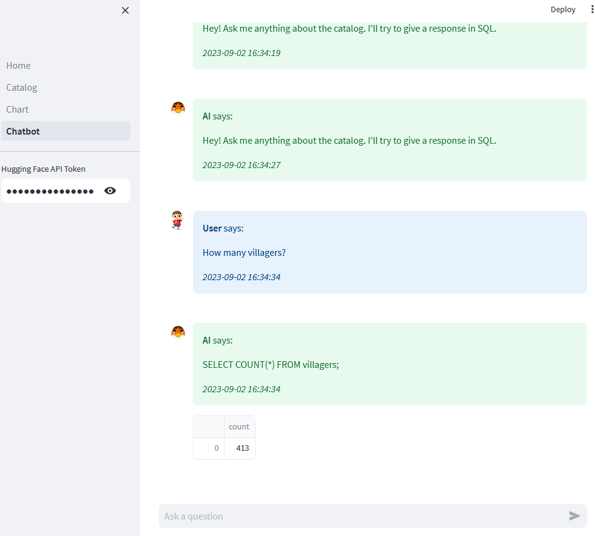

# ACNH Dashboard

### Features
- Home
- Catalog
- Chart
- Chatbot
<p align="center">
  
</p>

### Note
- Chatbot uses the Huggingface (free) inference API and [NumbersStation/nsql-350M](https://huggingface.co/NumbersStation/nsql-350M)

### Quick start
1. Copy this repo
2. Create and activate Python virtual environment
```bash
python3 -m venv .venv && source .venv/bin/activate
``` 
3. Install Python requirements
```bash
pip install -r requirements.txt
``` 
4. Run Postgres container
```bash
docker compose up -d --build
``` 
5. Run Streamlit
```bash
streamlit run Home.py
``` 

